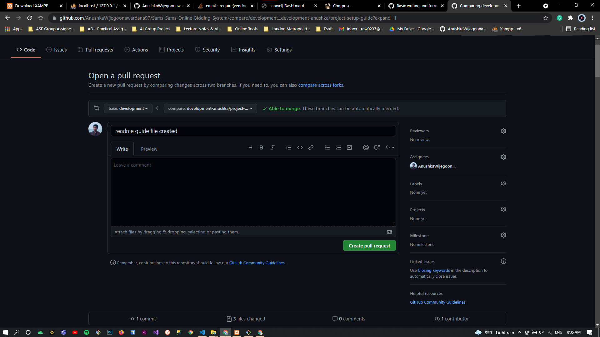

## Development Environment Requirements

-   [Xampp 7.3](https://www.apachefriends.org/download.html)
-   [npm](https://www.npmjs.com/)
-   [composer](https://getcomposer.org/)
-   IDE

## Setup the project in your local environment

-   **Step 01 - Clone the project from github**

    ```
    git clone https://github.com/AnushkaWijegoonawardana97/Sams-Sams-Online-Bidding-System.git
    ```

-   **Step 02 - Go to the project directory**

    ```
    cd Sams-Sams-Online-Bidding-System
    ```

-   **Step 03 - Checkout to the development branch**

    ```
    git checkout development
    ```

-   **Step 04 - Create a .env file form the .env.example**

-   **Step 05 - Create a new database from phpmyadmin**

-   **Step 06 - Replace these database details in the .env file to yours**

    ```
    DB_CONNECTION=mysql
    DB_HOST=127.0.0.1
    DB_PORT=3306
    DB_DATABASE=<<your-db-name>>
    DB_USERNAME=<<your-db-username>>
    DB_PASSWORD=<<your-db-pw>>
    ```

-   **Step 07 - Run Composer install**

    ```
    composer install
    ```

-   **Step 08 - Run these artisan comanda one by one in order**

    ```
    php artisan key:generate

    php artisan config:cache

    php artisan migrate

    php artisan serve
    ```

-   **Step 09 - artisan serve will open your application in the loaclhost**

    ```
    open http://127.0.0.1:8000 in your browser
    ```

-   **Step 10 - to run the style files & js processors run these npm commands**

    ```
    npm install
    npm run watch
    ```

## Laravel Guide

[Laravel Guide](larvel.md)

## Contibution Guide

-   Take a pull from the development branch

    ```
    git pull origin development
    ```

-   Create a new branch for your each task

    ```
    git branch development-<name>/<task-name>

    eg : development-anushka/project-setup-guide
    ```

-   Checkout to the new branch

    ```
    git checkout <<branch-name>>
    ```

-   Development

*   Once you complete you tasks

    ```
    git add * .
    git commit -m "commit message"
    git push -u origin <your-branch-name>
    ```

*   then create the pull request to the development branch
    <p align="left"></p>
